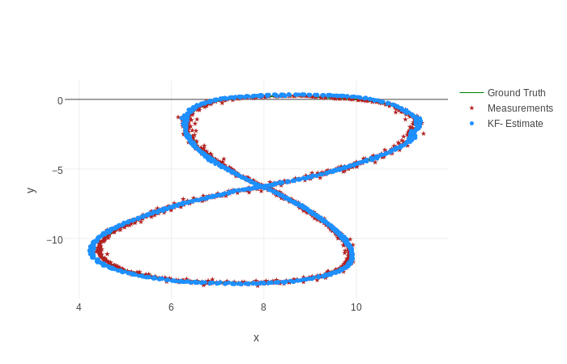
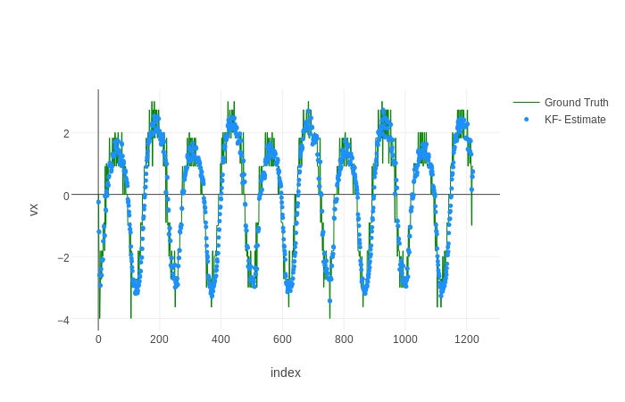
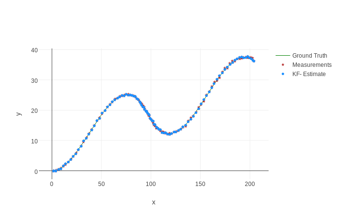
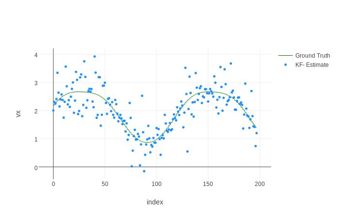
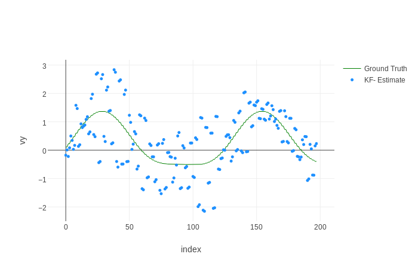

# LIDAR and RADAR Data Fusion with Extended Kalman Filter

Jun Zhu, April 15, 2017

## Introduction

In this project, a stream of simulated mixed LIDAR and RADAR data will be used to estimate the trajectory of an object moving in a curved trajectory by using the normal Kalman filter for the LIDAR data and the extended Kalman filter (EKF) for the RADAR data. The theory and formulas used in this project can be found [here](../KalmanFIlter.pdf). The measurement noises for the LIDAR data are $\sigma_x$ = $\sigma_y$ = 0.15 m. The measurement noises for the RADAR data are $\sigma_r$ = 0.30 m, $\sigma_\phi$ = 0.03 rad and $\sigma_\dot{r}$ = 0.3 m/s. 

## Simulation results

The results for two data sets with EKF implementation are shown below.

* [Test data 1](./data/sample-laser-radar-measurement-data-1.txt)

| RMSE  | LIDAR and RADAR | LIDAR only | RADAR only |
| :-------: | :------------------------: | :--------------: | :--------------: |
| x        |  0.065                 | 0.106                 |  0.130                 |
| y         | 0.063                 | 0.108                |  0.134                 |
| vx       | 0.53                   | 0.72                 |  0.60                 |
| vy       | 0.54                   | 0.64                 |  0.58                 |

*[Test data 2](./data/)

| RMSE  | LIDAR and RADAR | LIDAR only | RADAR only |
| :-------: | :------------------------: | :--------------: | :--------------: |
| x        |  0.185                 |  0.218       |  177          |
| y         | 0.190                |   0.194       |  22            |
| vx       | 0.47                  |   0.94        |  2.13         |
| vy       | 0.80                   |   0.83        |  0.77         |

## Discussion

 - The combination of LIDAR and RADAR data provides a more robust result.
 - The signal comes about every 50 ms in the data set 1, while the LIDAR and RADAR data come at the same time with an interval of 1 s in the data set 2. Therefore, the estimations using data set 2 are much worse than those using data set 1.